# Interactive Front-End Development Project
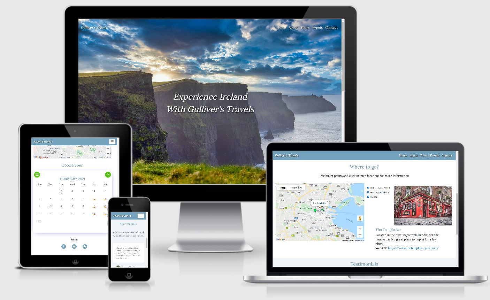
This website is a travel website for anyone interested in visiting or learning more about the island of Ireland. In addition to providing an informative service, this website will also provide the user with the ability to book tours within Ireland. The website contains frontend development features to provide information in an interactive and aesthetically pleasing manner. 

## UX
When designing this website, I followed the 5 levels of development, a well know web design process mentioned in Jesse James Garrett's book, The Elements of User Experience. The planning of each of these planes are to follow the same order as below with each plane aligning to the previous plane’s requirements. This ensures that the main objectives for the website identified in the Strategy plane aligns all the way through to the Surface Plane which identifies the actual features on the website.
- Strategy Plane
- Scope Plane
- Structure Plane
- Skeleton Plane
- Surface Plane

### Strategy Plane

#### Project Objectives
- Showcase the developer’s frontend development skills.
- Provide travel information on Ireland to the user.
- Provide information specific to the company's tours for the visitor
- Regarding tours, provide the user with the ability to check availability and book a tour.
- Allow the user to interact with the website to collect information in an aesthetically pleasing manner.
- Provide a means of contact for the visitor should they want to reach out to the company directly.

#### User Stories
- As a potential customer, I want to find travel information on Ireland, so that I can identify if it is a suitable holiday destination for me.
- As a potential customer, I want to find information on the company’s tours, so that I can decide if the tours are suitable to me.
- As a potential customer, I want to check availability of tours, so that I can identify if the options are feasible for me.
- As a potential customer, I want to book a tour, so that I can guarantee my place on the tour.
- As a potential customer, I want to contact the company, so that I can provide feedback or ask any unanswered questions.

### Scope Plane
The scope plane ensures that the website sections align to the objects and that these don’t grow in number throughout the project.
- Necessary sections which align to the project objectives and user stories mentioned in the Structure plane are as below. 
- For this project we will include all phase 1 sections and omit phase 2 sections until a later sprint due to resource capacity. 

#### Phase 1
The first phase of the website will consist of 5 pages. The map and testimonial sections will be located on the Home page.
- Home
  - Map
  - Testimonials
- About
- Contact
- Book a tour
- Events

#### Phase 2
The second phase will be added at a later stage due to time and content capacity. As the company is yet to give any tours, there is a lack of content for the Gallery section.
- History
- Gallery

### Structure Plane
- Primary Color: The primary color for the website will be a light blue as the pages welcome images include naturist elements such as the sky, water and clouds and this blue has an aestectica;ly pleasing relationship with the websites images.
- Navbar: The Navbar will be this primary color to set the theme throughout.
- Header: This primary colour is used as the header font color throughout.
- Background: The background will be plane white with a light blue for certain sections to match the navbar and other elements.
- Font Awesome: Font Awesome Icons were used throughout the website to provide more information links.

### Skeleton Plane
Once the sections and layout has been identified as in the previous planes, we can get started with the Skeleton Plane.
The Skeleton Planes outlines the arrangement of each section on the website and the best way to design these are by creating wireframes.
I initially drew these wireframes before creating using Balsamiq software.

#### Home page
##### Desktop
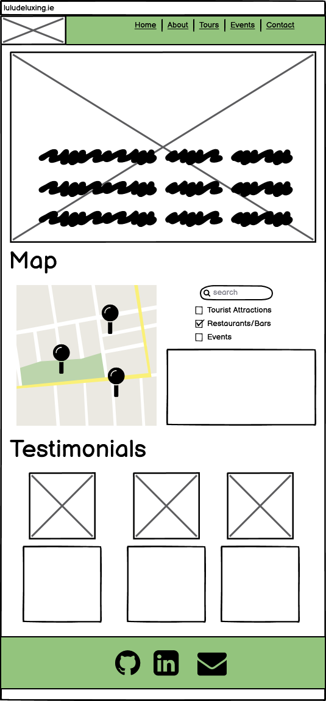

##### Mobile
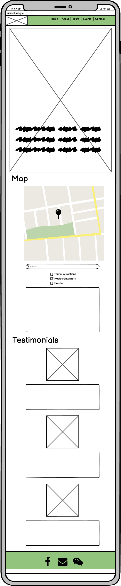

#### About page
##### Desktop

##### Mobile

#### Contact page
##### Desktop
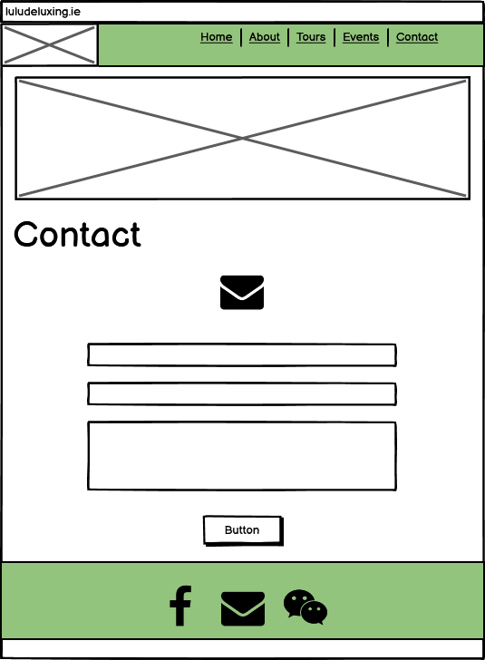

##### Mobile
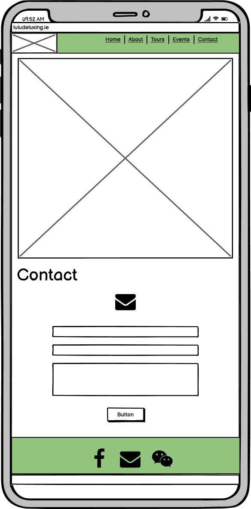

#### Book (a tour) page
##### Desktop
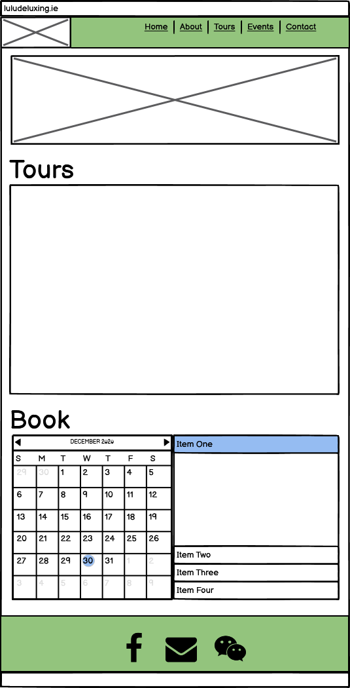

##### Mobile

#### Events page
##### Desktop
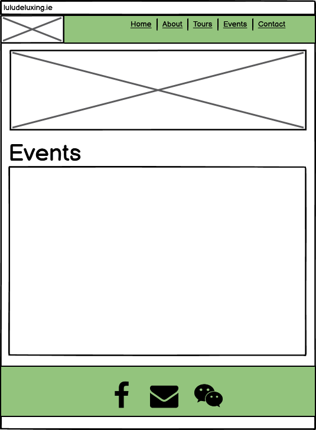

##### Mobile

### Surface Plane
The surface plane is the least conceptual plane and consists of the actual content and features on the website.

#### Features
Please see below list of features present on the website

- Navbar: A responsive Navbar will feature on the website so the user can easily navigate to other pages.
- Images: As this is a travel website, this website will be image heavy as a selling point to the visitor for what Ireland has to offer.
- Carousel: To ensure an engaging website which can portray to the visitor the beauty of Ireland, an image Carousel will be used for aesthetics and to increase the capacity for images.
- Form: To ensure the visitors can contact the company with any further queries a form will be included.
- Interactive Map: A Google Maps API will be used to provide the visitor with information based on location. 
- Testimonial boxes: Testimonial boxes of previous customer will be included so the visitor can get some further information from previous customers.
- Calendar Appointment Booking System: If the customer wants to book a tour, they can check availability and book a place using the Calendar Appointment Booking System. 

#### Future Features
- Logo: The brand logo is currently represented by the site name in the top left-hand corner. I plan to design a more unique logo using Adobe Illustrator in the future.
- Language: I intend on translating the website to Mandarin Chinese to tailor for the Chinese market. This feature will be an optional change which the user can action using a trigger in the top corner.
- Gallery Slideshow: As there is a lack of real world images, when tours can commence there will be an inventory of media to display in a galery section. I plan to implement a slideshow section to portray this.

## Technologies Used
The main technologies used are as below.

- HTML
  Used to add content to the website
- CSS
  Used to add structure and design to my site
- JavaScript & jQuery
  Used to create and edit interactive features such as maps, calendar, carousel and navbar 
- CodePen
  Used for the map feature, which required a lot of trial and error. CodePen was great to instantly see how my changes effected positioning.
- Bootstrap
  Used throughout the website to easily implement consistent designs. Bootstrap was used for the Navbar, Carousel, Forms and Mosal items. The Bootstrap Grid System was implemeted throughout. 
- Epicbootstrap
  - Used to implement the homepage testimonial section.
- Font Awesome
  - Font Awesome was used to input icons throughout the project. I used 4 different icons throughout the project.
- Balsamiq
  - Used in the design process for wireframes.
- Pxhere, Pexels, Unsplash
  - Used for images and design inspiration.
- Google Fonts
  - Used for font implementation and inspiration.
- GitPod
  - Used to create, commit and push the HTML and CSS changes for the website.
- GitHub
  - Used to deploy the website and store files and code.
- ColorPick Eyedropper
  - Used this google chrome extension to trail various colors apparent in my images.
- Stackoverflow
  - Used for problem solving to implement desired designs.
  - Used to gain better understanding of how I should approach the implementation of elements.
- W3Schools
  - Used to gather a theoretical knowledge of elements and effects 
- W3 HTML Validator
  - Used throughout  the project to ensure I was following best practices with HTML code.
- Jigsaw CSS Validator
  - Used throughout  the project to ensure I was following best practices with CSS code.
- JSHint JavaScript Validator
  - Used throughout  the project to ensure I was following best practices with JavaScript code.

## Testing
### Testing User Stories
#### As a potential customer, I want to find travel information on Ireland, so that I can identify if it is a suitable holiday destination for me.
- The home page map section provides information on Ireland based on type of destination, Tourist Attractions, Restaurants/Bars or Events. 
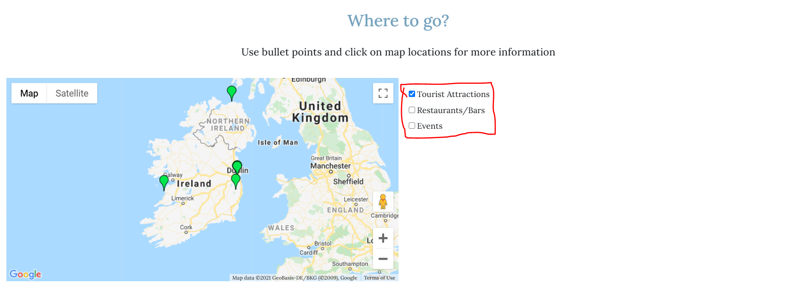

- Upon selection of the pin location, information is provided relating to that destination. Information will appear so that the user can decide if Ireland is a suitable destination based on their interests in these locations.
- Should the user require more information, they can select the link below the information paragraph which will lead them to an external page where they can find more information.
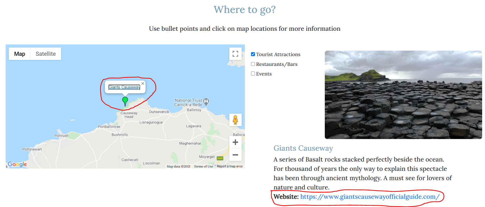

- The Events section provides information on events which occur in Ireland throughout the year.
- The user can find travel information related to Ireland based on these events and if they require more information, they can select the link provided which will lead them to an external page where they can find more information.
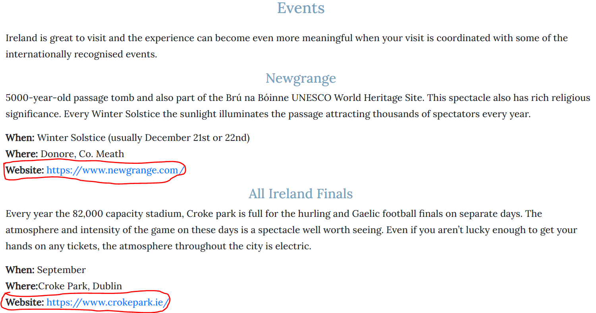

#### As a potential customer, I want to find information on the company’s tours, so that I can decide if the tours are suitable to me.
- The user can find information relating to the tours by navigating to the 'tours' page.
- The user is provided with information such as frequency, duration, starting point and trail of the tour.
- Below this information, there is also a map including markers relating to each location on the tour so the user can get a visual overview of the tour.
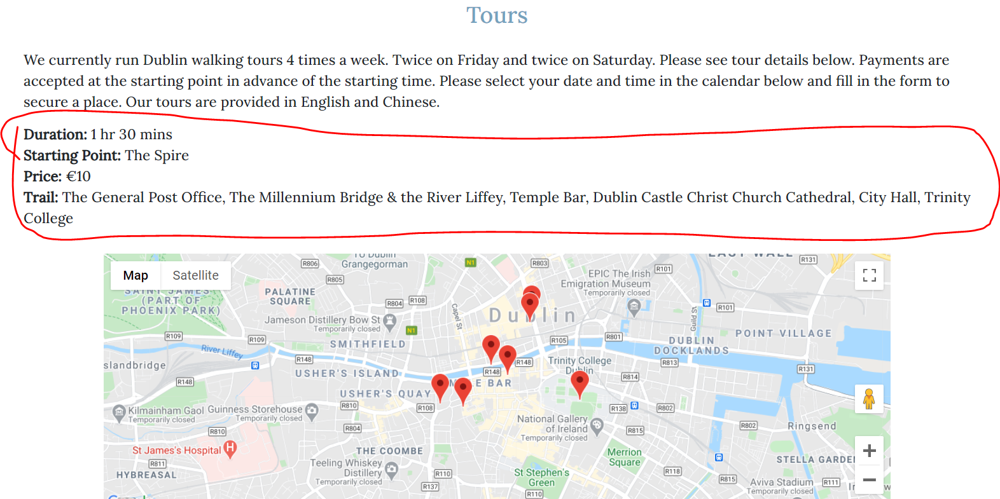

#### As a potential customer, I want to check availability of tours, so that I can identify if the options are feasible for me.
- The user can find this information by scrolling to the end of the tours page.
- They will see a Calendar with a red and yellow dot relating to dates where availability of tour places can be found.
- For dates where no tours are available, they will see "No tours available for this day" in the event column on the right-hand side.
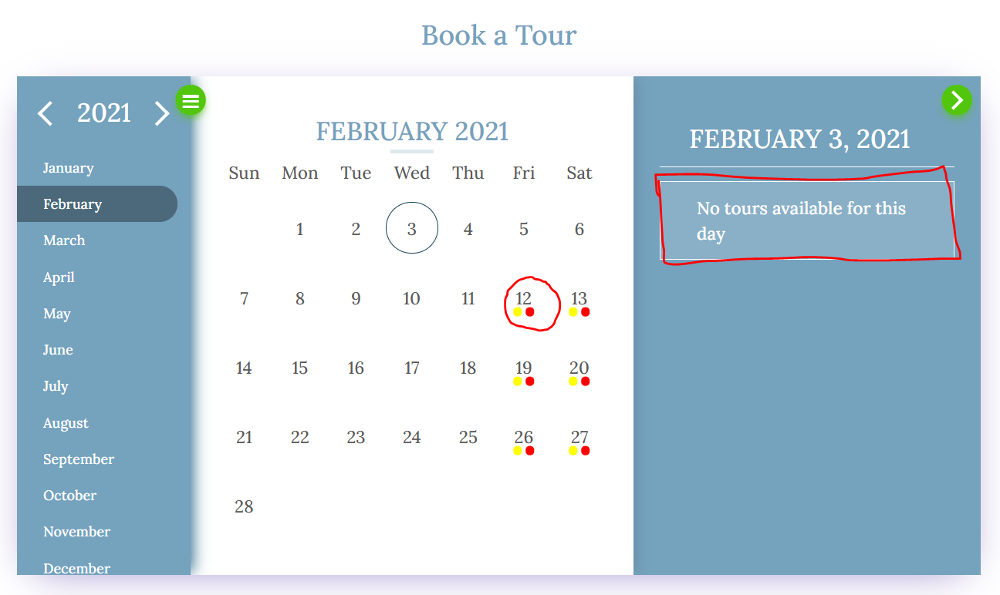

- When they select the desired available date, the option between a morning tour or noon tour will be provided in the event column on the right-hand side.
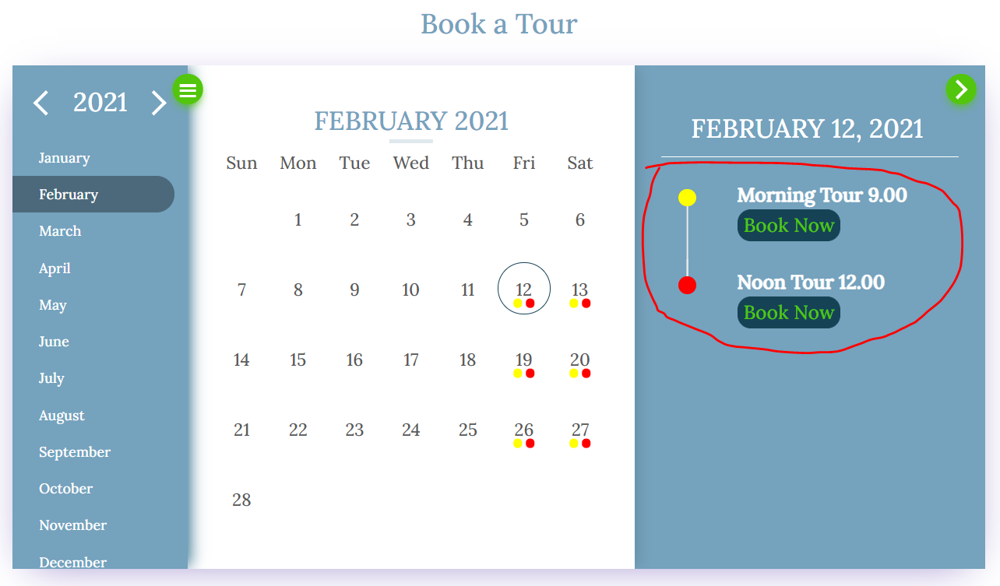

#### As a potential customer, I want to book a tour, so that I can guarantee my place on the tour.
- User can book a place and guarantee their place on a tour by navigating to the calendar and the bottom of the tours page.
- When the desired date with availability is selected, they can choose between the "Morning Tour 9.00" or the "Noon Tour 12.00".

- When the desired event is selected a form pop up will appear where the user can input relevant information.
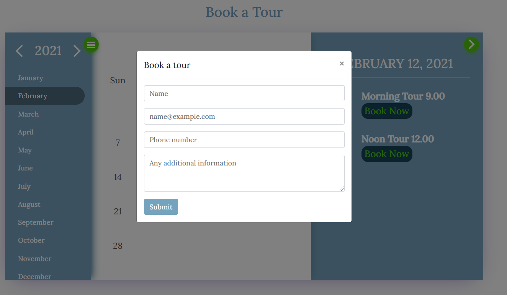

- The user can then enter their name, email and phone number along with optional additional information before selecting the Submit button which will guarantee their place.
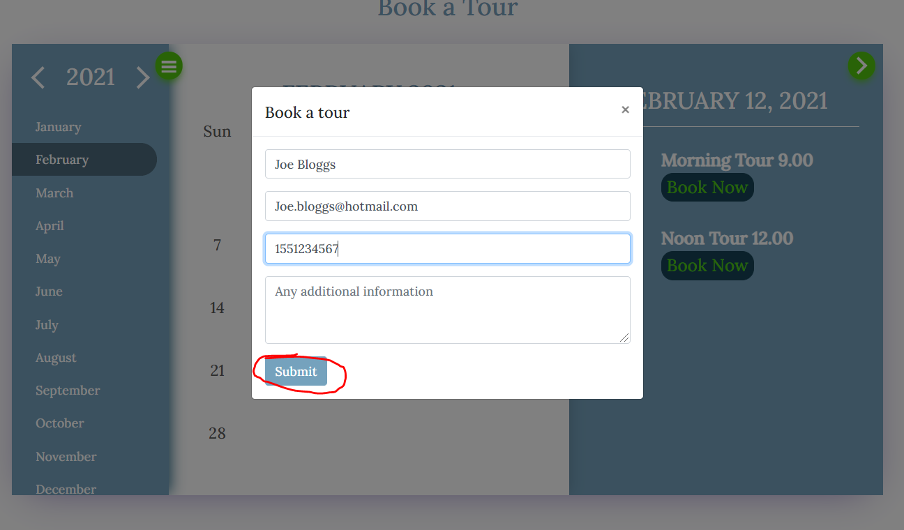

#### As a potential customer, I want to contact the company, so that I can provide feedback or ask any unanswered questions.
- The user can contact the company for any further information by navigating the contact page.
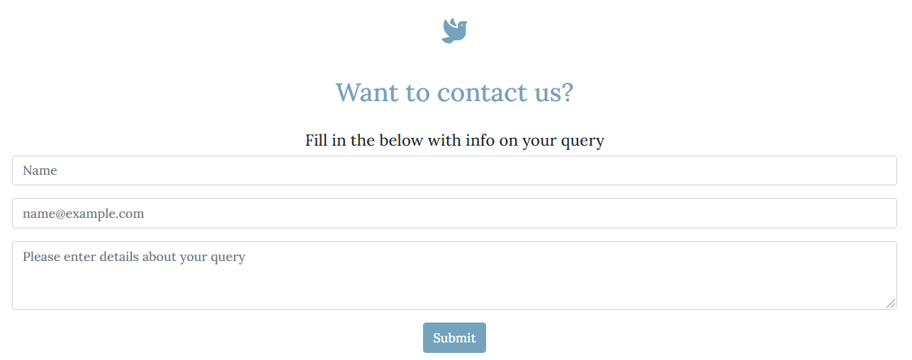

- The user can then scroll down to the "Want to contact us?" form where they can enter their name, emails and query which will be routed to the company.
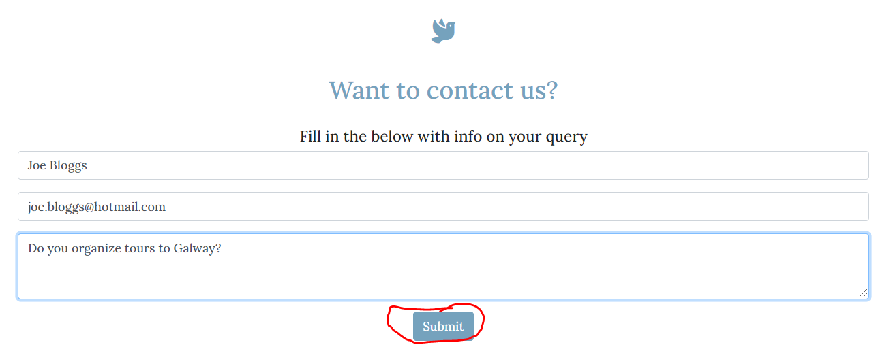

### Browsers
Tested and working consistently on the below browsers for desktop.
- Google Chrome
- Microsoft Edge 
- Firefox

- Mobile version manually tested throughout using google chrome on Xiaomi 8.

- Tested on below screen sizes using Google Chrome developer tools.
  - Moto G4
  - Galaxy S5
  - Pixel 2
  - Pixel 2 XL
  - iPhone 5/SE
  - iPhone 6/7/8
  - iPhone 6/7/8 Plus
  - iPhone X
  - iPad
  - iPad Pro
  - Surface Duo
  - Galaxy Fold

- The project passed the below validation tests. Please see below links to view validation screenshot.
  - W3 HTML Validator: https://validator.w3.org/
    - <a href="assets/images/user_story_testing/w3validator_html_index.PNG" target="_blank">index.html Validator success</a>
    - <a href="assets/images/user_story_testing/w3validator_html_about.PNG" target="_blank">about.html Validator success</a>
    - <a href="assets/images/user_story_testing/w3validator_html_events.PNG" target="_blank">events.html Validator success</a>
    - <a href="assets/images/user_story_testing/w3validator_tours_tours.PNG" target="_blank">tours.html Validator success</a>
    - <a href="assets/images/user_story_testing/w3validator_html_contact.PNG" target="_blank">contact.html Validator success</a>

  - Jigsaw CSS Validator: https://validator.w3.org/
    - <a href="assets/images/user_story_testing/w3validator_css.PNG" target="_blank">style.css Validator success</a>

- The project passed the below validation test, besides one reoccuring issue which is discussed in more detail in the Known Bugs and Fixes Section of this README.
 - JSHint JavaScript Validator: https://jshint.com/
    - <a href="assets/images/user_story_testing/jshintvalidator_js.PNG" target="_blank">.js files Validator results</a>

## Deployment
This project was created using GitPod for commit and push actions.
This project was deployed using GitHub pages at https://daithioc95.github.io/MS2 as below

### Deploying the project
1. In the GitHub repository, navigate to the settings tab.
2. Locate the GitHub Pages section.
3. Change source to master and select "Save"
4. To confirm, scroll down to the same section on the refreshed page and the "Your site is published at https://daithioc95.github.io/MS2/" will appear.

### Cloning the project
If you wish to clone this project, action the following instructions.

1. On the repository "Code" tab, select the "Code" option at the top right.
2. Copy the URL provided in the HTTPS section.
3. Open the GitPod (or favoured environment) terminal and change to the desired directory for the clone to be located. 
4. Enter command "git clone" and paste the previously copied URL.
5. Hit enter and the clone will be created.

## Known Bugs and Fixes
- Evo-Calendar
    - For mobile devices, when closing the events section on there appears to be an issue with closing. It is expected to gradually slide in, however it slides a fraction before closing abruptly. This is a known issue and I plan to fix this at a later stage.
    - Occasionally the event section closes involuntarily when scrolling on mobile devices. 

- JSHint issue
    - The below issue  appears when using the JShint validator despite the code fullfilling it's functionality.
    - "Functions declared within loops referencing an outer scoped variable may lead to confusing semantics. (W083)"
    - The reason for this error is because a function is declared within the for loop. I have trialed a series of different approaches to remove this error, however it still appears. The function is needed to appear within the loop in order to implement the location title above the specified marker.
    - This may be down to how the google maps API elements interacts with Jshint.
    - The error occurs for each category of map markers meaning it occurs once in the maps2.js file and 3 times in the maps.js file.

## Credits
### Content
All the content was written by me.

### Images
Please see below for links regarding every image used in the website.

- Home Carousel 1: https://www.pexels.com/photo/photo-of-seaside-during-dawn-4055520/
- Home Carousel 2: https://www.pexels.com/photo/body-of-water-with-rock-under-white-sky-1650829/
- Home Carousel 3: https://pxhere.com/en/photo/485672
- Cliffs of Mohar: https://www.pexels.com/photo/photo-of-seaside-during-dawn-4055520/
- Guinness Storehouse: https://unsplash.com/photos/1Rfjzq1DJYM
- Giants Causeway: https://pxhere.com/en/photo/1079780
- National Gallery logo: https://www.nationalgallery.ie/
- Croke Park: https://pxhere.com/en/photo/696967
- Glendalough: https://www.pexels.com/photo/body-of-water-with-rock-under-white-sky-1650829/
- The Temple bar: https://pxhere.com/en/photo/1186862
- Newgrange: https://pxhere.com/en/photo/1079777
- St. Patricks day: https://pxhere.com/en/photo/129772
- Wexford opera festival: https://unsplash.com/photos/GYgYPW2QgLM
- Testimonial headshot 1: https://www.pexels.com/photo/woman-taking-selfie-1288171/
- Testimonial headshot 2: https://www.pexels.com/photo/portrait-photo-of-man-1722198/
- Testimonial headshot 3: https://www.pexels.com/photo/man-in-red-button-up-shirt-smiling-3777946/
- About Welcome: https://pxhere.com/en/photo/916193
- Tours Welcome: https://pxhere.com/en/photo/1000001
- Events Welcome: https://pxhere.com/en/photo/1079777
- Contact Welcome: https://www.pexels.com/photo/white-concrete-bridge-3566191/

### Acknowledgments
- Navbar: The reappearing Navbar was achieved by editing code provided by Albi as per following link (https://codepen.io/albizan/full/mMWdWZ)
- Maps: The 2 maps used throughout the website was used using the Google maps API.
    - The JavaScript was acquired by using the Google maps tutorials and the YouTube video as per links below.
        - https://developers.google.com/maps/documentation/javascript/
        - https://www.youtube.com/watch?v=Zxf1mnP5zcw
    - The below Stackoverflow post was a great help in implementing the checkbox which interacted with the homepage google map to drop markers.
        - https://stackoverflow.com/questions/14544104/checkbox-check-event-listener
    - The smoothzoom function was implemented which allowed for a long distant zoom to pin. The solution was achieved thanks to the below Stackoverflow post.
        - https://stackoverflow.com/questions/4752340/how-to-zoom-in-smoothly-on-a-marker-in-google-maps
    - Removing map pins was achieved thanks to the below post.
        - https://intellipaat.com/community/26710/google-maps-api-v3-how-to-remove-all-markers
- Evo-Calendar: I used a JavaScript plugin called evo-calendar thanks to developer Edlyn Villegas for usage and editing information as per below GitHub repository.
    - https://github.com/edlynvillegas/evo-calendar
    - In order to create a loop which would add a series of events, I used code from the below webpage.
        - https://www.foxinfotech.in/2020/03/javascript-increment-date-by-1-day-examples.html
    - To open the event lister for mobile device, I achieved this using code from the below webpage.
        - https://www.tutorialrepublic.com/faq/how-to-detect-a-mobile-device-in-jquery.php
- The testimonial section on the bottom of the homepage was achieved by utilizing code from the below webpage.
    - https://epicbootstrap.com/snippets/testimonials
- Bootstrap: Bootstrap was used for the below elements.
    - Navbar: https://getbootstrap.com/docs/4.0/components/navbar/
    - Carousel: https://getbootstrap.com/docs/4.0/components/carousel/
    - Grid System: https://getbootstrap.com/docs/4.0/layout/grid/
    - Form in the contact and tours section: https://getbootstrap.com/docs/4.0/components/forms/
    - Modal in the tours section: https://getbootstrap.com/docs/4.2/components/modal/
- Inspiration to use font awesome icons with hover glow in the footer section was also from the CodeInstitutes "Mini Project".
- Thanks to the Code Institute Tutors for helping me with problem solving.
    - In particular with regards to the the JShint function issue.
- Thanks to my mentor, Nishant Kumar for guidance throughout the project.
- The form submit button message prompt was completed using JavaScript written by Mark Railton. 
- Thanks to the Code Institute Slack channel for providing me with a wealth of information on every aspect of the project.
- The Elements of User Experience by Jesse James Garrett's book helped during the design process as mentioned in the UX section of the ReadMe
- Used elements of my Milestone Project One ReadMe to approach the design process in a similar manner. https://github.com/daithioc95/MS1

